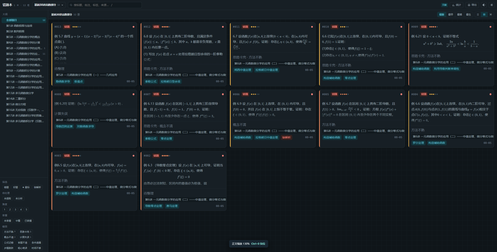

# 错题本

错题管理工具。从 PDF 截图粘进来，AI 转成可搜索的 LaTeX 文本，自动标考点、判难度、归章节。

数据全部存在本地。配合本地 Ollama 可以完全离线使用。

Windows 桌面版（Electron）是**唯一写入方**；出门时用**只读网页版**在手机上看错题。

---

## 📱 网页版（只读镜像）

> **https://cuotiben.yqsony0130.top**

桌面版把数据推到云端（Cloudflare Worker + D1 + KV），网页版拉取镜像，只读展示。适合出门在手机上看题，不适合编辑。

**隐私说明**：云端只上传**题目提取出的文字**、**答案解析/补充的截图**和书籍/章节/考点等元数据；**题目的原始截图不上传**（在本地保留）。云端数据用 PUSH_TOKEN 保护，网页版可再加 Cloudflare Access 登录墙（推荐）。

---

## ✨ 截图



（更多截图可放 `screenshots/` 目录，命名如 `detail.png`、`stats.png`，这里按需补充引用）

---

## 功能

### 录入
- **Ctrl+V 粘贴截图直接建题**，不用先新建再上传
- 拖拽图片文件，支持一次多张；多张时可选「每张一题」或「合并成一题」
- 自动裁掉截图四周的纯色白边
- 每道题三个槽位：题目 / 答案解析 / 补充材料

### AI
- **截图 → LaTeX**：视觉模型把题目转成 Markdown + LaTeX，流式显示，可手动修正
- **自动标注**：考点、难度（1–5，有明确评分标准）、所属章节，直接写入不用逐个确认
- **就题目对话**：问思路、问为什么、说出自己的做法让它挑错
- **从目录建章节**：粘贴教材目录文本或截图，自动解析层级批量建树

考点标签有复用机制——分析时会把本书已有的考点清单一起传给模型，要求含义相同就复用原词，避免「洛必达法则」和「洛必达」这类同义标签把统计打乱。

### 组织与查找
- 书籍 → 多级章节树，可折叠、上下移、升级、并入
- 拖卡片到章节上归类
- 全文搜索，覆盖标题、批注、来源、考点和**提取出的 LaTeX 正文**
- 筛选：错题/好题 · 星标 · 缺解析 · **未提取** · **未分析** · 难度 · 掌握度 · 错因
- 四种排序、三种视图密度

### 批量操作
选择模式下支持 Shift 段选、Ctrl+A 全选，可批量**提取文字 / 分析考点 / 移到章节 / 设掌握度 / 加星标 / 删除**。

配合「未提取」「未分析」筛选，工作流是闭环的：

```
筛「未提取」→ Ctrl+A → 批量提取
筛「未分析」→ Ctrl+A → 批量分析
```

中途断了重新筛一次就是剩下的，不会重跑已完成的。

### 复习与输出
- 答案解析默认折叠，进详情页只展开题干
- 掌握度三档 + 复习次数记录
- 统计看板：章节薄弱度、错因分布、知识点分布、录入趋势
- 打印导出 PDF，可选**文字版**（可选中、可搜索、体积小）或**截图版**（保留原排版）

### 其他
- 暗色模式，图片按底色极性自动反相（浅底图在暗色下反相，深底图在白天反相，彩色图不动）
- Ctrl+滚轮缩放正文
- 回收站，删除的题连同截图保留，可恢复
- 增量备份，对网盘同步友好（见下）

---

## 快速开始

### 用打包好的版本

到 Releases 下载 `Cuotiben-Setup-x.y.z.exe`（安装版）或 `Cuotiben-Portable-x.y.z.exe`（免安装）。

两者是同一个程序，共用同一份数据。日常用安装版即可——免安装版每次启动要先解压，慢几秒，且不带快捷方式。

### 从源码运行

```bash
npm install
npm run dev        # 浏览器版，localhost:5173
npm run dev:app    # Electron 版，自动起 Vite 并拉起窗口
```

---

## AI 配置

设置 → AI。有**两个独立的模型槽**：

| 槽       | 作用                  | 要求           |
| -------- | --------------------- | -------------- |
| **提取** | 截图 → LaTeX 文本     | 必须有视觉能力 |
| **分析** | 文本 → 考点/难度/章节 | 纯文本模型即可 |

两个槽可以配同一个模型，也可以混搭。**推荐混搭**：本地视觉模型做 OCR + 云端强模型做推理，效果和成本都是最优的。

协议统一走 OpenAI 兼容接口，所以 Ollama、DeepSeek、硅基流动、OpenRouter、Groq、智谱、Kimi 都能直接用，换服务商只要改三个字段。

### 本地 Ollama（提取槽）

```bash
ollama pull qwen2.5vl:7b
```

设置里点「Ollama 本地」预设 → 「拉取列表」→ 选一个带 `vl` / `vision` 的模型 → 「测试连接」。

> 本地模型**首次调用要把权重加载进显存，几十秒是正常的**。测试连接时会显示秒表，别以为卡死了。

### DeepSeek（分析槽）

点「DeepSeek」预设，填 API Key，测试连接。

> ⚠️ **DeepSeek 只能在桌面版里用**。它的接口不发 CORS 头，浏览器直连必然失败。桌面版的请求走主进程转发，没有这个限制。
>
> 同理，浏览器模式下调 Ollama 需要设 `OLLAMA_ORIGINS=*`。

API Key 在桌面版里用系统加密存储（Windows DPAPI），不进浏览器数据库。

---

## 数据与备份

### 数据存在哪

|          | 位置                  |
| -------- | --------------------- |
| 桌面版   | `%APPDATA%\cuotiben\` |
| 浏览器版 | 该站点的 IndexedDB    |

**桌面版和浏览器版的数据不互通**（不同 origin），开发模式和打包版本也不互通。切换时用「导出全部 → 从备份恢复」搬运。

### 云同步（网页版）

桌面版设置 → 云同步，配置 API 地址和 PUSH_TOKEN 后，把**元数据**（书籍、章节、题目、考点、批注）和**答案解析/补充的截图**推送到云端。网页版只读拉取。

| 数据 | 是否上云 | 说明 |
| --- | --- | --- |
| 题目截图 | ❌ 不上传 | 只在本地保留；网页端题目显示 AI 提取的文字 |
| 题目提取文字 | ✅ 上传 | 供网页端显示题目内容 |
| 答案解析（文字+截图） | ✅ 上传 | 网页端可看文字和截图 |
| 补充材料（文字+截图） | ✅ 上传 | 同上 |
| 书籍/章节/题目元数据 | ✅ 上传 | 含考点、难度、掌握度、批注 |

> ⚠️ **云端是公开地址的话，任何知道 URL 的人都能看**。请务必在 Cloudflare Zero Trust 里加 Access 登录墙（只放行你的邮箱），详见 `docs/cloudflare-setup.md` 第 12 步。

### 自动备份（推荐开启）

设置 → 备份 → 自动备份，选一个目录。用的是**增量格式**：

```
备份目录/
  images/
    <图片id>.webp           按 id 命名，只写一次，之后永不改动
  meta-20260806-1430.json   每次一份，只有元数据，几百 KB
```

**把目录设成网盘的同步文件夹**（百度网盘同步空间、坚果云、OneDrive 均可），同步客户端就只需要传新题的截图，不会每天重传几百 MB。

对比一下 500 题规模：

|            | 单文件格式   | 增量格式               |
| ---------- | ------------ | ---------------------- |
| 每次上传   | ~270 MB 全量 | 只有新增截图 + 几百 KB |
| 保留 30 份 | 不现实       | 多花约 10 MB           |

因为快照极便宜，默认保留 30 份——误删了题，翻出三天前的快照就能捞回来。

手动导出仍然是单文件 JSON，方便发给别人或临时归档。

---

## 构建

```bash
npm run dist
```

产物在 `release/`，同时出安装版和免安装版。

**国内网络需要镜像**。electron-builder 会从 GitHub 拉 NSIS 工具链，经常在下载途中被掐断（表现为进度走到 100% 后报 `The server aborted pending request`）。项目里的 `electron-builder.env` 已经配好 npmmirror 镜像。

如果构建到最后报 `Can't open output file`，通常是杀毒软件把刚生成的安装包锁了——把项目目录加进白名单再试。

---

## 项目结构

```
index.html              DOM 骨架，约 110 行
src/
  main.js               入口：事件绑定与启动流程
  core/                 纯逻辑，不碰渲染
    dom fmt consts state selectors bus md
  storage/              IndexedDB 与图片处理
    db repo images backup
  ai/                   AI 适配层
    config client queue prompts tasks toc
  ui/                   各视图，靠 bus 解耦
  styles/               按区域拆分的 CSS
electron/
  main.cjs              窗口、菜单、IPC 注册
  preload.cjs           contextBridge 暴露 window.native
  ai-proxy.cjs          AI 请求转发（绕开 CORS，key 不进渲染进程）
  secrets.cjs           safeStorage 加密存取
  backup.cjs            备份写盘与轮换
worker/
  index.js              Cloudflare Worker 云端 API（snapshot/push/img/prune）
  schema.sql            D1 表结构
  wrangler.toml.example 部署模板（真实配置 wrangler.toml 已 gitignore）
```

**没有前端框架**，原生 ES modules + 事件委托。UI 模块之间不直接互相调用渲染函数，改动通过 `core/bus.js` 发事件——这样拆模块时不会绕出循环依赖。

`core/selectors.js` 里是所有不碰 DOM 的纯函数（章节树、筛选、统计），UI 层可以随意引用。

---

## 已知限制

- **几何图形转不了文字**。视觉模型会在原位置留一行 `[图：直角三角形 ABC，∠C=90°]` 这样的描述。因为截图仍然保留着，阅读不受影响，只是 AI 分析这类题时信息少一些。
- **复杂公式偶尔会认错**。这是模型能力边界，提取出来之后可以手动改。
- **本地 7B 模型较慢**，一张图几十秒。批量任务默认串行——并发跑视觉模型容易把显存打爆。
- **网页版是只读的**。要编辑、录入、删除，请用桌面版，改完点「云同步」推送。
- **题目截图不上云**。云端只存题目文字和答案/补充的截图，所以网页版看不了题目的原始截图（本地桌面版不受影响）。

## 计划中

- 复习排程，按掌握度和间隔推荐今天该重做哪些
- 题型归纳与知识框架，详见 [docs/knowledge-graph.md](docs/knowledge-graph.md)
- 桌面端 → 云端冲突处理（目前单向推送，网页端只读）

---

## 技术栈

Vite · 原生 ES Modules · IndexedDB · KaTeX · Electron
